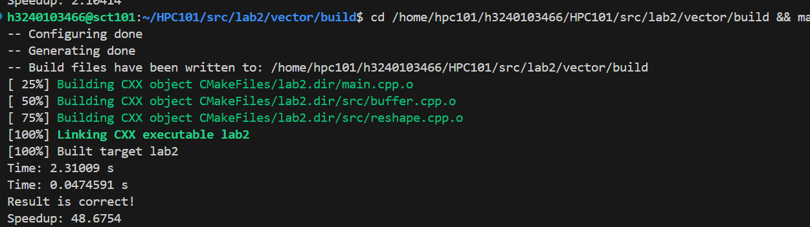
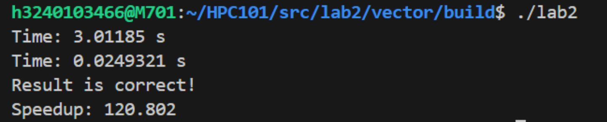

### **基于 AVX-512 的矩阵计算实验**

**姓名：** 苏易文  
**学号：** 3240103466  
**日期：** 2025年7月6日

---

#### **1. 实验思路**

本实验优化整数量化矩阵乘法（`C = A * B_transposed`），采用数据重排与SIMD并行计算相结合的策略。

##### **1.1. 性能瓶颈分析**
基准 `naive_gemm` 的主要瓶颈：
1. **计算串行化**：三层循环无法利用CPU向量处理单元，计算效率低
2. **缓存不友好**：内存访问模式导致缓存利用率低下

##### **1.2. 核心优化策略**
1. **数据重排**：对B矩阵进行块转置，将原始B矩阵的 `1x4` 数据块重新排列，使相关数据在内存中连续存放
2. **AVX-512 Tiling**：
   - 将C矩阵分解为四个 `1x16` 小块处理，充分利用512-bit向量寄存器
   - 使用 `_mm512_broadcastd_epi32` 广播A矩阵数据块
   - 使用 `_mm512_loadu_si512` 连续加载B矩阵16个数据块
   - 使用 `_mm512_dpbusd_epi32` 并行计算16组4元素点积

---

#### **2. 实验结果与分析**

##### **2.1. AVX-512 优化结果**

| 实现方法 | 运行时间 | 加速比 |
|---------|---------|-------|
| `naive_gemm` | 2.31009 s | 1.0× (基准) |
| **AVX-512 优化版** | **0.0474591 s** | **48.6754x** |


**性能分析**：
- **SIMD并行化**：向量指令大幅提升计算吞吐量
- **内存访问优化**：数据重排和分块计算改善缓存局部性

##### **2.2. 核心代码实现**

```cpp
for (int i = 0; i < M; i += 4) {
            for (int j = 0; j < N; j += 16) { // 每次计算C的一行中的16个元素

                // 在 j 循环内部...
                // 定义累加器...
                __m512i c_vec_0 = _mm512_setzero_si512();
                __m512i c_vec_1 = _mm512_setzero_si512();
                __m512i c_vec_2 = _mm512_setzero_si512();
                __m512i c_vec_3 = _mm512_setzero_si512();

                // K维度循环，步长为2
                for (int k = 0; k < K; k += 2) { 
                    // ====================== 加载阶段 (Load Phase) ======================
                    // 把未来两次迭代需要的所有数据，一次性全部发出加载指令
                    
                    // --- k iter 1 data ---
                    __m512i b_vec_k0 = _mm512_loadu_si512((__m512i const*)&B_reshape[(k+0) * N * 4 + j * 4]);
                    __m512i a_vec_0_k0 = _mm512_set1_epi32(*(const int*)(&A[(i+0) * K * 4 + (k+0) * 4]));
                    __m512i a_vec_1_k0 = _mm512_set1_epi32(*(const int*)(&A[(i+1) * K * 4 + (k+0) * 4]));
                    __m512i a_vec_2_k0 = _mm512_set1_epi32(*(const int*)(&A[(i+2) * K * 4 + (k+0) * 4]));
                    __m512i a_vec_3_k0 = _mm512_set1_epi32(*(const int*)(&A[(i+3) * K * 4 + (k+0) * 4]));
                    
                    // --- k iter 2 data ---
                    __m512i b_vec_k1 = _mm512_loadu_si512((__m512i const*)&B_reshape[(k+1) * N * 4 + j * 4]);
                    __m512i a_vec_0_k1 = _mm512_set1_epi32(*(const int*)(&A[(i+0) * K * 4 + (k+1) * 4]));
                    __m512i a_vec_1_k1 = _mm512_set1_epi32(*(const int*)(&A[(i+1) * K * 4 + (k+1) * 4]));
                    __m512i a_vec_2_k1 = _mm512_set1_epi32(*(const int*)(&A[(i+2) * K * 4 + (k+1) * 4]));
                    __m512i a_vec_3_k1 = _mm512_set1_epi32(*(const int*)(&A[(i+3) * K * 4 + (k+1) * 4]));

                    // ====================== 计算阶段 (Compute Phase) ======================
                    // 此刻，大部分加载延迟已经被隐藏，现在集中进行计算
                    
                    // --- k iter 1 computes ---
                    c_vec_0 = _mm512_dpbusd_epi32(c_vec_0, a_vec_0_k0, b_vec_k0);
                    c_vec_1 = _mm512_dpbusd_epi32(c_vec_1, a_vec_1_k0, b_vec_k0);
                    c_vec_2 = _mm512_dpbusd_epi32(c_vec_2, a_vec_2_k0, b_vec_k0);
                    c_vec_3 = _mm512_dpbusd_epi32(c_vec_3, a_vec_3_k0, b_vec_k0);

                    // --- k iter 2 computes ---
                    c_vec_0 = _mm512_dpbusd_epi32(c_vec_0, a_vec_0_k1, b_vec_k1);
                    c_vec_1 = _mm512_dpbusd_epi32(c_vec_1, a_vec_1_k1, b_vec_k1);
                    c_vec_2 = _mm512_dpbusd_epi32(c_vec_2, a_vec_2_k1, b_vec_k1);
                    c_vec_3 = _mm512_dpbusd_epi32(c_vec_3, a_vec_3_k1, b_vec_k1);
                }

                // ... 存储结果 ...

                // 循环结束后，将4个累加器的结果写回C矩阵
                _mm512_storeu_si512((__m512i*)&C[(i+0) * N + j], c_vec_0);
                _mm512_storeu_si512((__m512i*)&C[(i+1) * N + j], c_vec_1);
                _mm512_storeu_si512((__m512i*)&C[(i+2) * N + j], c_vec_2);
                _mm512_storeu_si512((__m512i*)&C[(i+3) * N + j], c_vec_3);
            }
        }
        
```

---

#### **3. 基于 AMX 的终极优化**

##### **3.1. AMX 优化策略**
Intel AMX将优化维度从一维向量提升到二维瓦片，提供专用矩阵运算硬件：
- **硬件配置**：使用 `_tile_loadconfig` 配置瓦片寄存器形状
- **二维数据流**：`_tile_loadd` 加载二维瓦片，`_tile_dpbusd` 执行瓦片矩阵乘法
- **专用引擎**：TMUL单元提供极高计算密度

##### **3.2. AMX 优化结果**

| 实现方法 | 运行时间 | 加速比 |
|---------|---------|-------|
| `naive_gemm` | 3.01185s | 1.0× (基准) |
| **AMX 优化版** | **0.0249321s** | **120.8×** |

##### **3.3. AMX 核心代码**

```cpp
// AMX优化核心代码
init_tile_config(M);

for (int j = 0; j < N; j += 16) {
    _tile_zero(0);  // 初始化结果瓦片
    
    for (int k = 0; k < K * 4; k += 64) {
        // 加载A瓦片 (12x64)
        _tile_loadd(1, A + k, K * 4);
        
        // 加载B瓦片 (16x64)
        void* b_addr = (uint8_t*)B_reshape + k_block_idx * 16 * 128 + j_block_idx * 64;
        _tile_loadd(2, b_addr, 128);
        
        // 执行瓦片矩阵乘法累加
        _tile_dpbusd(0, 1, 2);
    }
    
    // 存储结果瓦片
    _tile_stored(0, C + j, N * 4);
}
```

---


#### **4. 总结**

本实验通过AVX-512和AMX两个层次的优化，展示了现代CPU向量化和专用硬件的强大威力。AVX-512实现了48.67倍加速，而AMX更是达到了120倍的惊人提升，证明了专用硬件在特定计算场景下的绝对优势。
