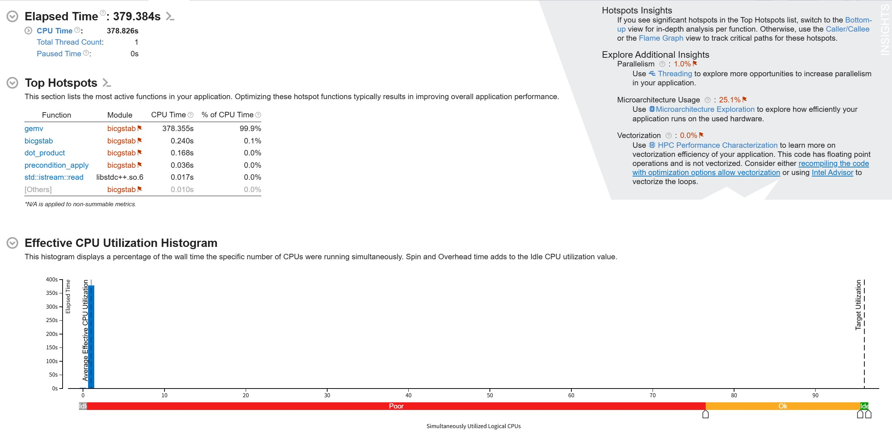
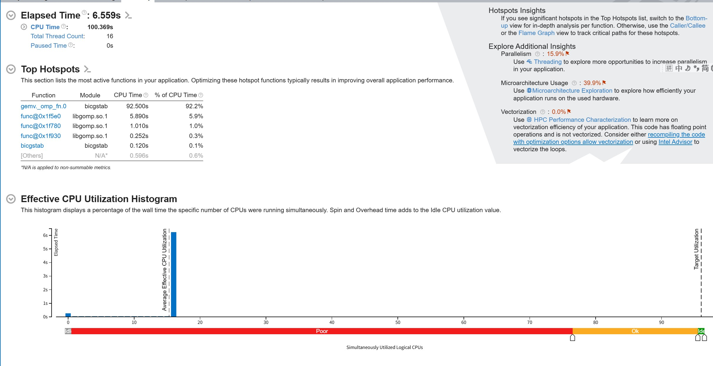
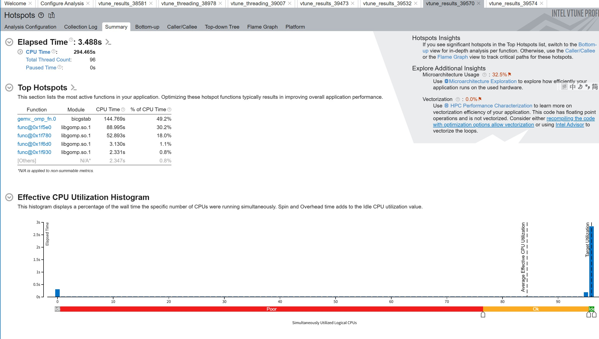
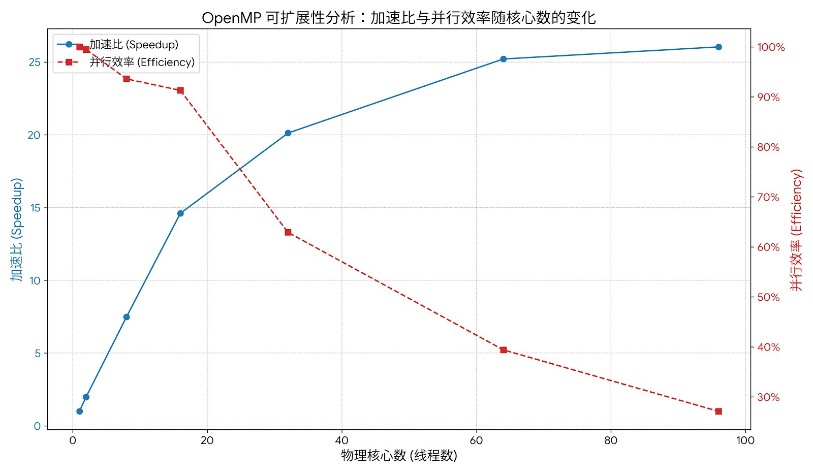

### 基于MPI+OpenMP混合并行的BiCGSTAB算法实现与调优

**姓名：苏易文** **学号：3240103466**

------

### **一、 项目概述与串行基准**

本项目旨在对一个BiCGSTAB迭代求解器进行从零开始的性能优化。优化的核心方法论是：首先通过性能剖析工具定位计算瓶颈，然后依次采用编译器优化、基于OpenMP的单节点共享内存并行，以及基于MPI的分布式内存并行和MPI+OpenMP混合并行策略，最终分析不同策略的性能表现与核心瓶颈。

**1.1 初始性能基准**

> 初始程序未经任何优化，通过Intel VTune Profiler分析，在处理`case_2001.bin`数据时，**总耗时为379.384秒**。性能热点分析显示，超过99%的计算时间消耗在`gemv`（矩阵向量乘法）函数中，明确了其为核心优化目标。

**1.2 编译器优化** 为建立一个更具竞争力的基准，首先启用编译器优化。通过在`CMakeLists.txt`中设置编译标志为`-O2`，程序的性能得到显著提升。

- **优化后耗时**：**93.877秒**
- **加速比**：**4.04x** (相较于初始版本)

这证明了现代编译器在代码优化中的重要作用，并为后续的并行优化提供了一个更高的起点。

### **二、 OpenMP共享内存并行优化**

针对`gemv`函数这一计算瓶颈，我们采用OpenMP模型在单计算节点内进行并行化。

**2.1 优化思路演进**

1. **失败的尝试**：最初试图使用`collapse(2)`和`reduction(+:y)`对`gemv`的内外两层循环同时进行并行化。此方案因两个核心问题而失败：
   - **语义错误**：OpenMP的`reduction`子句不支持对C/C++数组直接进行归约。
   - **粒度过细**：`collapse(2)`导致任务粒度过细，高昂的线程调度和同步开销反而会降低性能。
2. **成功的修正**：正确的并行化策略应抓住`gemv`函数外层循环的天然数据独立性。每个`y[i]`的计算过程互不依赖。因此，最终方案如下：
   - **仅并行化外层循环**：使用`#pragma omp parallel for`指令，将外层循环的迭代任务分配给多个线程。
   - **使用线程私有累加器**：在循环体内定义`double sum = 0.0;`，使其成为线程私有变量，避免了对共享内存的反复写入，减少了内存访问开销。

**2.2 OpenMP可扩展性分析**

为确定最优线程数并评估并行效率，我们系统性地测试了不同核心数下的性能表现。

| 物理核心数(线程数) | 运行时间 (Time) | 加速比 (Speedup) | 并行效率 (Efficiency) |
| ------------------ | --------------- | ---------------- | --------------------- |
| 1                  | 1m 33.076s      | 1.00x            | 100.0%                |
| 8                  | 0m 12.423s      | 7.49x            | 93.6%                 |
| 16                 | 0m 6.559s       | 14.60x           | 91.3%                 |
| 32                 | 0m 4.626s       | 20.12x           | 62.9%                 |
| 64                 | 0m 3.692s       | 25.21x           | 39.4%                 |
| 96                 | 0m 3.488s       | 26.04x           | 27.1%                 |

**分析结论：**

- **1-32核心**：程序展现出接近理想的线性加速，并行效率高。这证明了OpenMP并行策略的正确性和高效性。
- **32核心以上**：性能出现拐点，并行效率急剧下降。这是由于集群资源限制（单个任务最多64个逻辑核心）和严重的超线程资源争用（缓存、计算单元竞争）导致的。

尽管96线程时运行时间最短（**3.488秒**），但这已是“伪并行”下的结果。然而，从单节点优化的角度看，我们获得了相对于优化后串行版本**108.8倍**的惊人加速。

------

### **三、 MPI分布式与混合模型探索**

为探索跨节点的并行能力，我们进一步引入了MPI。

**3.1 纯MPI模型实现与挑战**

1. **并行策略**：采用按行分解的策略，主进程（rank 0）负责读取数据，并通过`MPI_Scatterv`将矩阵`A`和向量`b`的行分发给各个工作进程。
2. **算法改造**：
   - **点积计算**：各进程计算局部点积，通过`MPI_Allreduce`进行全局求和。
   - **矩阵向量乘法**：`gemv`需要一个完整的全局向量。因此，每次乘法前，必须通过`MPI_Allgatherv`将各进程的局部向量收集并重组为全局向量。
3. **遇到的挑战**：
   - **环境配置**：遇到了大量环境问题，如CMake需强制指定`mpicc`，SLURM需配置`pmi2`才能正确引导MPI进程等。
   - **性能瓶颈**：纯MPI版本性能极差，无法在规定时间内完成。通过调试发现，程序在`MPI_Allgatherv`上消耗了巨量时间，**通信开销成为了新的、压倒性的瓶颈**。

**3.2 MPI+OpenMP混合模型**

为缓解MPI的通信瓶颈，我们采用了“少进程、多线程”的混合编程模型。

- **配置**：将SLURM配置改为2个MPI进程，每个进程内部使用48个OpenMP线程。
- **逻辑**：此举旨在将原来需要跨节点网络进行的MPI通信，最大限度地转化为节点内部高效的共享内存计算，从而降低通信延迟。
- **最终性能**：**12.5秒**。

> ITAC性能分析报告证实了我们的判断。在12.5秒的总时间中，MPI通信时间占了**1.67秒 (13.4%)**。其中，耗时最长的MPI函数是`MPI_Allreduce` (57.5%) 和 `MPI_Allgatherv` (40.2%)，这与算法设计中的全局同步和数据收集操作完全对应。

### **四、 最终结论**

| 优化阶段             | 配置/说明                 | 总运行时间 (s) | 加速比 (相对串行) | 备注                       |
| -------------------- | ------------------------- | -------------- | ----------------- | -------------------------- |
| **串行**             | **1 核心**                | **379.384**    | **1.0x**          | **初始基准**               |
| **编译优化 (-O2)**   | 1 核心                    | 93.877         | 4.04x             | 编译器优化生效             |
| **OpenMP (96 线程)** | **单节点 (NUMA 约束)**    | **3.488**      | **108.8x**        | **最优OpenMP结果**         |
| **纯 MPI (16 进程)** | 多节点，通信频繁          | > 10min        | -                 | 性能极差，通信瓶颈压倒计算 |
| **MPI+OpenMP 混合**  | **2 进程 × 48 线程/节点** | **12.5**       | **30.4x**         | **通信瓶颈仍然明显**       |

本次性能优化的核心结论如下：

1. **通信开销是根本限制**：对于BiCGSTAB这类每次迭代都包含全局数据交换（矩阵向量乘法）和同步（点积）的算法，通信开销是制约其并行性能的核心瓶颈。
2. **共享内存优势明显**：在单节点内，OpenMP利用共享内存，无网络通信开销，因此取得了最佳性能。
3. **混合模型是一种权衡**：“少进程、多线程”的混合模型虽能极大缓解纯MPI的通信压力，但只要存在跨节点通信，其开销依然显著，导致其性能无法超越最优的纯OpenMP版本。
4. **算法层优化是方向**：要进一步提升此类通信密集型算法的性能，单纯依赖并行化策略已达极限，必须转向能够减少或隐藏通信的算法层面优化（如Communication-Avoiding算法）。