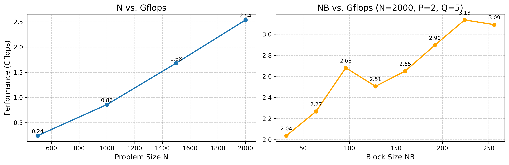

# 《迷你计算集群搭建及 HPL 性能测试》项目报告

**报告人：** 苏易文 (学号: 3240103466)  
**日期：** 2025年6月  

---

## 📌 项目简介

本项目在一台独立宿主机上，通过 **VMware 虚拟机** 从零搭建了一个含 4 个计算节点的迷你高性能计算集群。核心工作包括：  

- 从源码编译与配置 **OpenMPI、BLAS、CBLAS、HPL** 等并行计算组件  
- 运行 **HPL (High-Performance Linpack)** 基准测试并进行系统性性能调优  
- 涉及 **集群搭建、网络配置、并行程序编译、性能分析与参数优化** 的完整实践流程  

---

## ⚙️ 技术栈

- **虚拟化环境**：VMware Workstation Pro  
- **操作系统**：Debian 12.2.0  
- **并行计算框架**：OpenMPI 5.0.3  
- **核心数学库**：BLAS 3.12.0, CBLAS  
- **基准测试**：HPL 2.3  
- **编译工具**：GCC 12.2.0, GFortran, Make  
- **网络服务**：SSH, NFS (Bonus), LDAP (Bonus)  

---

## 🚀 最终成果

- **峰值性能**：3.1339 Gflops  
- **最优配置**：N=2000, NB=224, PxQ=2×5  

---

## 🔧 集群架构与配置

- 共 4 个节点，每节点 **2 核 CPU + 2 GB 内存**  
- VMware **NAT 模式**组网，`/etc/hosts` 静态解析  
- **SSH 免密登录**，确保 MPI 作业无障碍执行  

---

## 📈 HPL 性能调优

### 1. 问题规模 N 的影响 (固定 NB=128, P=2, Q=5)

- 随着 N 增大，通信开销被更好摊销  
- 在 `N=2000` 时取得最优性能  

结果如左图。

### 2. 分块大小 NB 的影响 (固定 N=2000, P=2, Q=5)

- Gflops 随 NB 增大 **先上升后略降**  
- 最优点在 `NB=224`，达到 **3.1339 Gflops**  

结果如右图。

---

## 🏆 最优性能参数

| 参数         | 最优值 | 性能 (Gflops) |
| ------------ | ------ | ------------- |
| 问题规模 N   | 2000   | **3.1339**    |
| 分块大小 NB  | 224    |               |
| 进程网格 P×Q | 2×5    |               |
| 运行时间     | 1.70s  |               |

---

## ⚠️ 关键挑战与解决方案

### 挑战一：HPL 编译链接失败 (`undefined reference to _gfortran_...`)

- **原因**：`mpicc` 链接 BLAS 时缺失 Fortran 运行库  
- **解决**：在 `Make.Linux_PII_FBLAS` 中追加 `-lgfortran`，成功生成 `xhpl`  

### 挑战二：CBLAS 测试程序编译报错

- **原因**：`testing/` 代码与 gfortran/BLAS 版本不兼容  
- **解决**：跳过测试程序，仅使用成功生成的 `cblas_LINUX.a` 库  

### 挑战三：NFS 客户端 `Permission denied`

- **原因**：直接导出 `/home`，权限不匹配  
- **解决**：新建 `/home/shared` 并赋予正确权限，仅导出该目录  

---